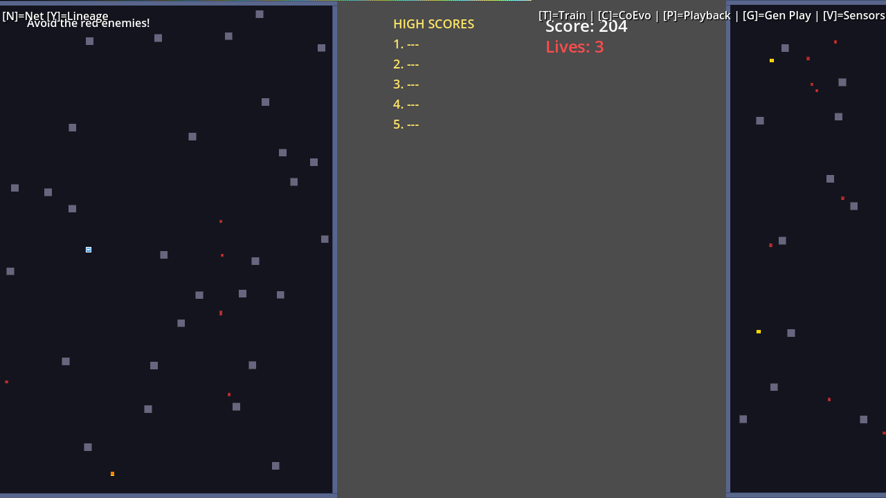
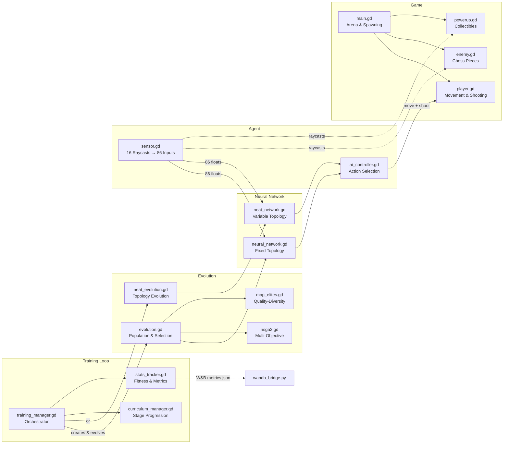
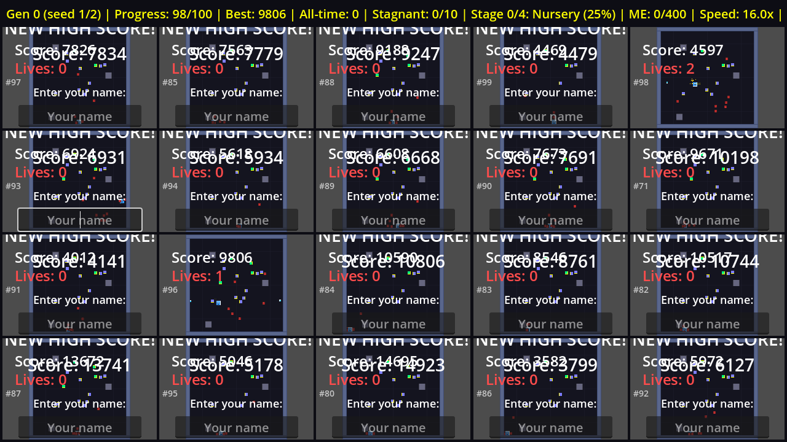

# Evolve

A 2D arcade survival game built with Godot 4.5+ where you dodge chess-piece enemies, collect power-ups, and compete for high scores — or let a neuroevolution AI learn to play for you.



## Gameplay

- Move with **arrow keys**, shoot with **WASD**
- Enemies are chess pieces (pawns, knights, bishops, rooks, queens) with chess-inspired movement patterns on a virtual grid
- Collect power-ups for speed boosts, invincibility, screen clears, and more
- Score increases over time and from killing enemies
- Difficulty ramps up as your score grows
- 3 lives, with respawn invincibility

## Running

Requires [Godot 4.5+](https://godotengine.org/download).

```bash
# Open in editor
godot --path . --editor

# Play directly
godot --path . --play
```

## Architecture



**Data flow:** Each generation, `training_manager` assigns neural networks from the evolution system to AI controllers in parallel arenas. Sensors feed 86 inputs (16 raycasts × 5 values + 6 player state) into the network, which outputs 6 actions (movement + shooting). Fitness scores flow back to the evolution system for selection and mutation.

## AI Training



Neural networks learn to play through neuroevolution — a population of agents evolves over generations using tournament selection, crossover, and mutation.

### Network Architecture

- **86 inputs**: 16 raycasts (enemy distance/type, obstacles, power-ups, walls) + player state
- **80 hidden neurons** (tanh activation, configurable)
- **6 outputs**: movement (x/y) + shoot directions

### Controls

| Key | Action |
|-----|--------|
| T | Start/stop training (48 parallel arenas) |
| P | Watch the best AI play |
| H | Return to human control |
| [ / ] | Adjust training speed (1x-8x) |

### Headless Training

```bash
godot --path . --headless -- --auto-train
```

### W&B Sweep Integration

Run hyperparameter sweeps with Weights & Biases:

```bash
cd overnight-agent
python overnight_evolve.py --project evolve-neuroevolution-new
```

## Testing

Run the headless test suite:

```bash
godot --headless --script test/test_runner.gd
```

## Project Structure

```
├── main.tscn/gd           # Game manager, UI, spawning
├── player.tscn/gd         # Player movement, collision, shooting
├── enemy.tscn/gd          # Chess piece enemies with grid movement
├── powerup.tscn/gd        # 10 power-up types
├── projectile.tscn/gd     # Player projectiles
├── training_manager.gd    # Training orchestration
├── ai/                    # Neural network, sensors, evolution
├── scripts/               # W&B bridge scripts
├── overnight-agent/       # Headless sweep runner
└── test/                  # Test suite
```
