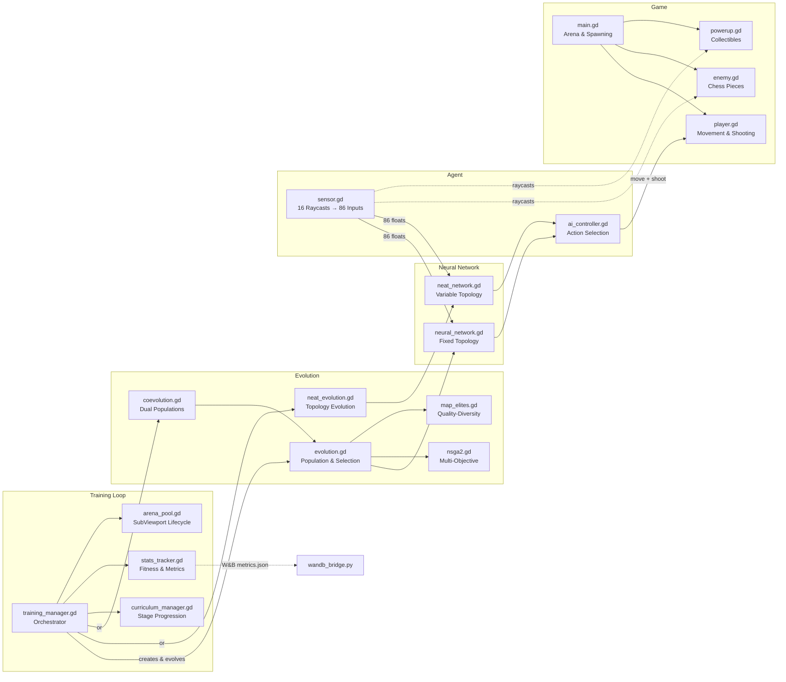

# Evolve

A 2D arcade survival game built with Godot 4.5+ where you dodge chess-piece enemies, collect power-ups, and compete for high scores — or train AI agents through neuroevolution to play for you.


## Features

- **Play as human** or watch evolved AI agents compete
- **Chess-themed enemies** with unique movement patterns (pawns, knights, bishops, rooks, queens)
- **Power-ups** for speed boosts, invincibility, screen clears, and more
- **Multiple evolution algorithms**: Standard evolution, NEAT, NSGA-II, MAP-Elites, Co-evolution
- **6 game modes**: Human, Training, Playback, Sandbox, Comparison, Archive Playback
- **Network visualizer** showing NEAT topologies and live neural activations
- **Curriculum learning** with progressive difficulty stages
- **W&B integration** for hyperparameter sweeps and metrics tracking
- **Parallel neural network inference** via Rust backend for efficient batch processing

## Running

Requires [Godot 4.5+](https://godotengine.org/download).

```bash
# Open in editor
godot --path . --editor

# Play directly
godot --path . --play
```

## Architecture



**Data flow:** Each generation, `training_manager` assigns neural networks from the evolution system to AI controllers in parallel arenas. Sensors feed 86 inputs (16 raycasts × 5 values + 6 player state) into the network, which outputs 6 actions (movement + shooting). Fitness scores flow back to the evolution system for selection and mutation.

## AI Training


Neural networks learn to play through neuroevolution — a population of agents evolves over generations using tournament selection, crossover, and mutation.

### Evolution Modes

- **Standard Evolution**: Fixed-topology networks with configurable hidden layers
- **NEAT**: Evolving network topologies through complexification
- **NSGA-II**: Multi-objective optimization (survival time, kills, powerup collection)
- **MAP-Elites**: Quality-diversity algorithm maintaining a 20×20 archive of diverse strategies
- **Co-evolution**: Dual populations where enemies evolve neural networks alongside players

### Network Architecture

- **86 inputs**: 16 raycasts (enemy distance/type, obstacles, power-ups, walls) + player state
- **Configurable hidden layers** (80 neurons optimal for standard evolution)
- **6 outputs**: movement (x/y) + shoot directions

### Controls

| Key | Action |
|-----|--------|
| T | Start/stop training (48 parallel arenas) |
| P | Watch the best AI play |
| S | Open sandbox mode |
| C | Compare strategies side-by-side |
| M | View MAP-Elites heatmap |
| V | Toggle sensor visualization |
| N | Show neural network topology |
| [ / ] | Adjust training speed (1x-16x) |

### Headless Training

```bash
godot --path . --headless -- --auto-train
```

### Curriculum Learning

Progressive difficulty stages automatically advance as population fitness improves:

- **Nursery** → **Elementary** → **Intermediate** → **Advanced** → **Final**

## Results

**Current best fitness:** 189,512 (sweep 84jfx9jj with optimized Bayesian config)

Key hyperparameters that work:
- Population size: 120
- Hidden neurons: 80
- Elite count: 20
- Mutation rate: 0.27
- Crossover rate: 0.70

See [RESULTS.md](RESULTS.md) for detailed sweep findings and algorithm comparisons.

## W&B Integration

Run hyperparameter sweeps with Weights & Biases:

```bash
cd overnight-agent
python overnight_evolve.py --project evolve-neuroevolution --hours 8
```

For detailed setup and webhook configuration, see [WANDB.md](WANDB.md).

## Testing

Run the headless test suite:

```bash
godot --headless --script test/test_runner.gd
```

## Project Structure

```
├── main.tscn/gd                # Game manager, UI, spawning
├── player.tscn/gd              # Player movement, collision, shooting
├── enemy.tscn/gd               # Chess piece enemies with grid movement
├── powerup.tscn/gd             # 10 power-up types
├── projectile.tscn/gd          # Player projectiles
├── training_manager.gd         # Training orchestration
├── ai/                         # Neural networks and evolution
│   ├── evolution.gd            # Standard evolution
│   ├── neat_evolution.gd       # NEAT implementation
│   ├── nsga2.gd               # Multi-objective optimization
│   ├── map_elites.gd          # Quality-diversity archive
│   ├── coevolution.gd         # Co-evolutionary training
│   ├── curriculum_manager.gd   # Progressive difficulty
│   ├── arena_pool.gd          # SubViewport management
│   └── stats_tracker.gd       # Fitness tracking
├── modes/                      # Game mode implementations
├── ui/                         # UI components
│   ├── network_visualizer.gd   # Neural network topology
│   ├── map_elites_heatmap.gd  # 20×20 strategy archive
│   └── comparison_panel.gd    # Side-by-side comparison
├── scripts/                    # W&B bridge and utilities
├── overnight-agent/            # Headless sweep runner
└── test/                       # Test suite
```

## Contributing

See [CONTRIBUTING.md](CONTRIBUTING.md) for development guidelines, PR process, and how to add new evolution algorithms.

## Known Issues

See [KNOWN_ISSUES.md](KNOWN_ISSUES.md) for current limitations and workarounds.